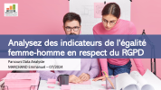

# Rapport-egalite-Homme-Femme-
Mise en place d'un rapport égalité H/F pour une société de conseil, et automatisation du calcul d'index d'égalité dans le respect du RGPD.

Réalisations : 
  + Contrôle de cohérence de données sources.
  + Automatisation de la préparation des données (fusion et anonymisation).
  + Choix et analyse de plusieurs indicateurs.
  + Calcul de l'index d'égalité.
  + Rédaction du rapport.

Softs Skills travaillées :
  +  Sourcing et analyse  d'informations officielles.
  +  Acquisition de connaissances sur les règles et la loi égalité H/F pour les TPE-PME (Surce Ministère du travail)
  +  Approfondissement sur les règles RGPD (Source CNIL).

Compétences travaillées :
  + Sélection d'indicateurs pertinents.
  + Création de reporting en adaptant les visualisations pour la compréhension des données.
  + Automatisation de calculs d'indicateurs (Knime).

Outils : 
  + Knime, Excel

